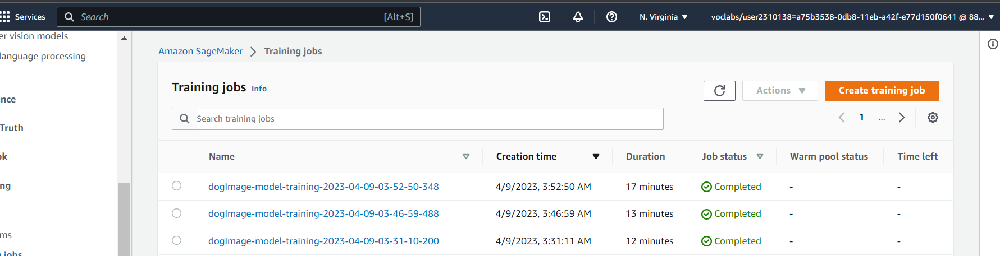

# Dog-breed-classification-using-AWS-Sagemaker
AWS Sagemaker platform was utilized to classify various breed of dog based on dog various images 

# Image Classification using AWS SageMaker

Use AWS Sagemaker to train a pretrained model that can perform image classification by using the Sagemaker profiling, debugger, hyperparameter tuning and other good ML engineering practices. This can be done on either the provided dog breed classication data set or one of your choice.

## Project Set Up and Installation
Enter AWS through the gateway in the course and open SageMaker Studio. 
Download the starter files.
Download/Make the dataset available. 

## Dataset
The provided dataset is the dogbreed classification dataset which can be found in the classroom.
The project is designed to be dataset independent so if there is a dataset that is more interesting or relevant to your work, you are welcome to use it to complete the project.

### Access
Upload the data to an S3 bucket through the AWS Gateway so that SageMaker has access to the data. 

## Hyperparameter Tuning
The ResNet50 model was used in performing the image classification. The RestNet50 used used to perform transfer learning on the dataset. 
Hyperparameters that were employed in the training included learning rate between 0.001 and 0.1, a continuous momentum between 0 and 1, and a batch size ranging from 32, 64, 128, 256.
The hpo.py script was used.

The best best hyperparameters retrieved from all training jobs were: 
 'batch-size': '"64"',
 'lr': '0.017347296140063206',
 'momentum': '0.6087771526396725',
 

## Model Training 
These best hyperparamters together with an epochs of 15 was used in the model training on the whole dataset 

## Debugging and Profiling
**TODO**: Give an overview of how you performed model debugging and profiling in Sagemaker

### Results
**TODO**: What are the results/insights did you get by profiling/debugging your model?

**TODO** Remember to provide the profiler html/pdf file in your submission.

## Model Deployment

