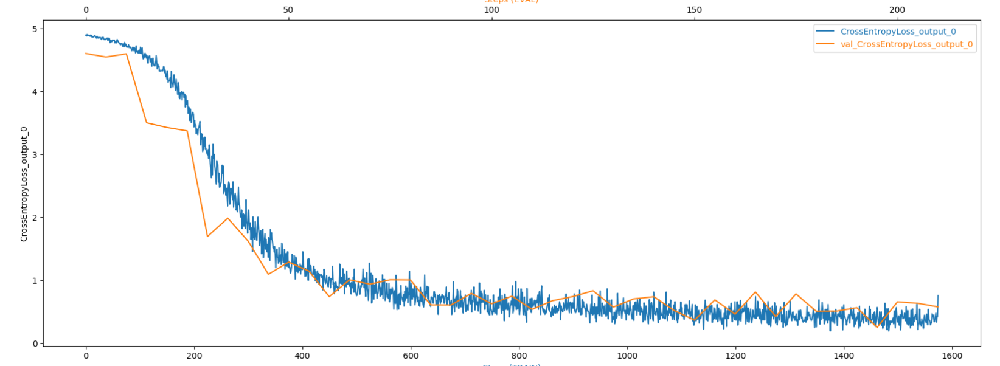
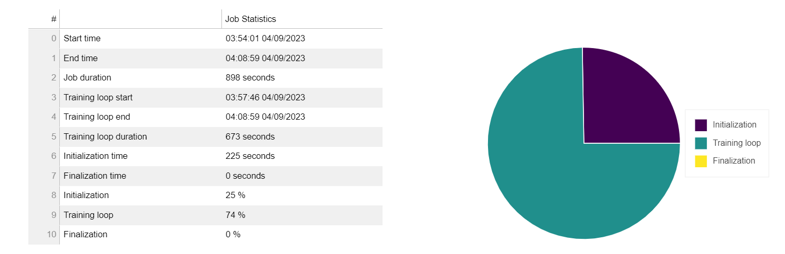
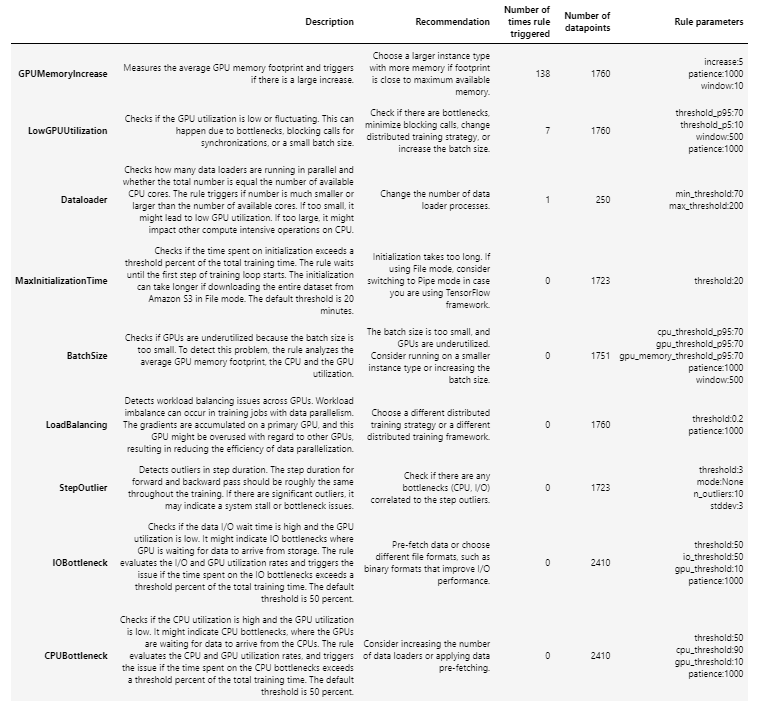
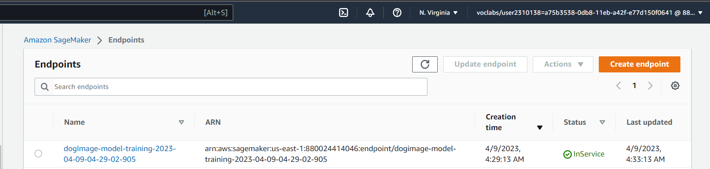

# Dog-breed-classification-using-AWS-Sagemaker
AWS Sagemaker platform was utilized to classify various breed of dog :dog2: based on dog various images 

# Image Classification using AWS SageMaker

Use AWS Sagemaker to train a pretrained model that can perform image classification by using the Sagemaker profiling, debugger, hyperparameter tuning and other good ML engineering practices. This can be done on either the provided dog breed classication data set or one of your choice.

## Project Set Up and Installation
Enter AWS through the gateway in the course and open SageMaker Studio. 
Download the starter files.
Download/Make the dataset available. 

## Dataset
The provided dataset is the dogbreed classification dataset which can be found in the classroom.
The project is designed to be dataset independent so if there is a dataset that is more interesting or relevant to your work, you are welcome to use it to complete the project.

### Access
Upload the data to an S3 bucket through the AWS Gateway so that SageMaker has access to the data. 

## Hyperparameter Tuning
The ResNet50 model was used in performing the image classification. The RestNet50 used used to perform transfer learning on the dataset. 
Hyperparameters that were employed in the training included learning rate between 0.001 and 0.1, a continuous momentum between 0 and 1, and a batch size ranging from 32, 64, 128, 256.
The hpo.py script was used.

The best best hyperparameters retrieved from all training jobs were: 
 'batch-size': '"64"',
 'lr': '0.017347296140063206',
 'momentum': '0.6087771526396725',
 

## Model Training 
These best hyperparamters together with an epochs of 15 was used in the model training on the whole dataset 

## Debugging and Profiling
smdebug was used in the Model debugging process. In order to monitor how well the model was training, the AWS Sagemaker debugger was used.
rules, debugger_hook_config, profiler_config, output_path were defined as passed to the estimator during the training process

### Results
**TODO**: What are the results/insights did you get by profiling/debugging your model?
The profiler report can be found in the directory , the  in the profier output specifically contains the report 

**TODO** Remember to provide the profiler html/pdf file in your submission.
Loss Plot 

#### Training Job summary
The following table gives a summary about the training job. The table includes information about when the training job started and ended, how much time initialization, training loop and finalization took.

#### Rule summary 
The following table shows a profiling summary of the Debugger built-in rules. The table is sorted by the rules that triggered the most frequently. During your training job, the GPUMemoryIncrease rule was the most frequently triggered. It processed 1760 datapoints and was triggered 138 times.

## Model Deployment

